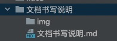
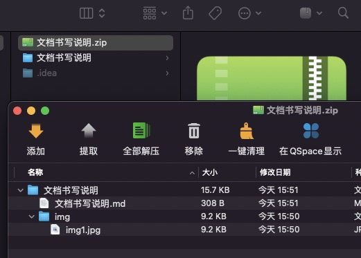
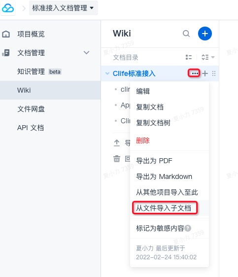
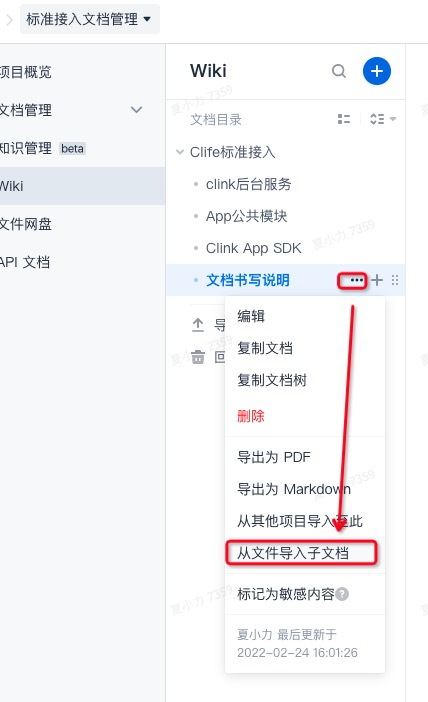

本文档主要讲解在Coding上书写wiki文档，以便将开发的SDK等文档信息对外提供。
对外的文档统一到“标准接入文档管理”->"文档管理"->"WiKi"里面

# 第一步：创建文档

1. 首先创建.md后缀的mardown文件；
2. 新建img文件夹，用于储存图片资源；

如图目录结构



## 第二步：将文档压缩zip

将mardown文档以及图片资源压缩为zip，详见如图目录结构（文件命名决定了目录名称）：



## 第三步：压缩文件上传至coding




## 二级目录使用说明

### 1. 首先创建好二级目录相关文件，如下图：


### 2. 上传二级目录至Coding，如下图：



## 图片资源使用方式如下图

```

```

注意：在md文档中指定图片的相对路径，当文档上传至Coding后，图片标签中的路径会自动变化。


